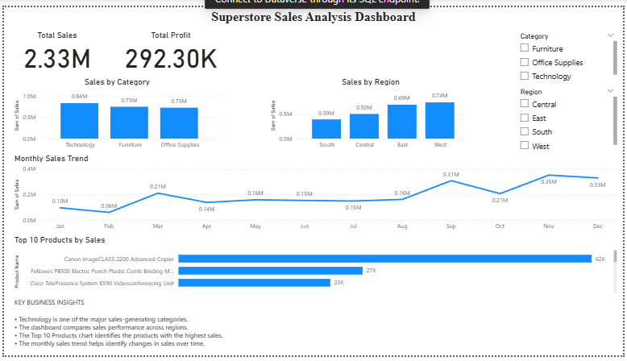

# Task 2 – Superstore Sales Dashboard

## Project Overview

This project presents an interactive Power BI dashboard created using the Superstore dataset.

## Dashboard Features

- Total Sales
- Total Profit
- Sales by Category
- Sales by Region
- Monthly Sales Trend
- Top 10 Products by Sales
- Category Slicer
- Region Slicer
- Key Business Insights

## Tools Used

- Power BI
- CSV Dataset

## Dashboard Preview

## Files

- `Task_2_Superstore_Dashboard.png` – Dashboard screenshot
- `Task_2_Superstore_Dashboard.pbix` – Power BI dashboard file
- `sample_-_superstore.csv` – Dataset
